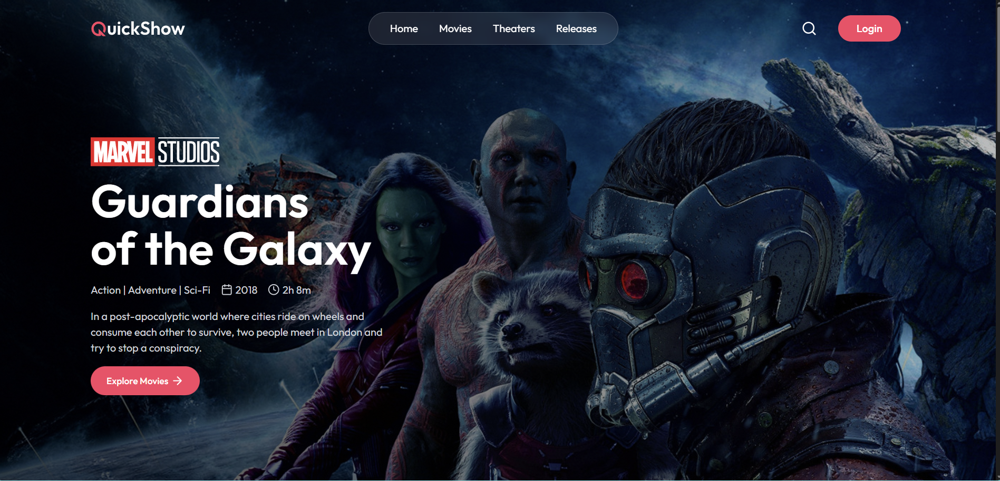
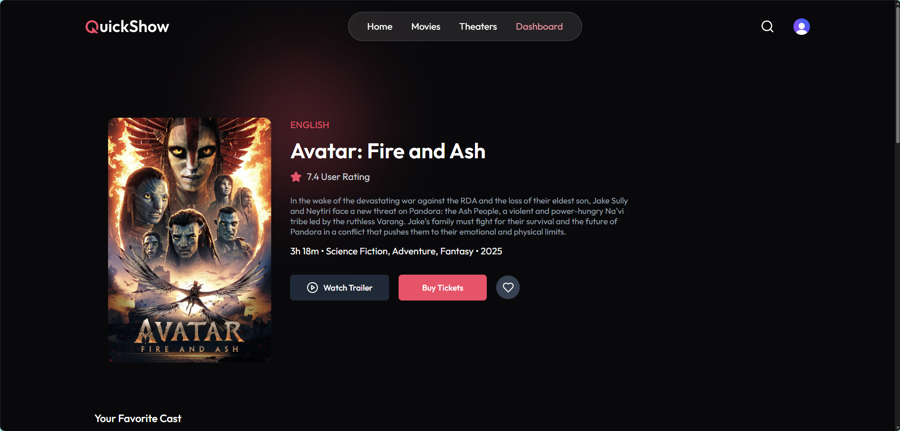
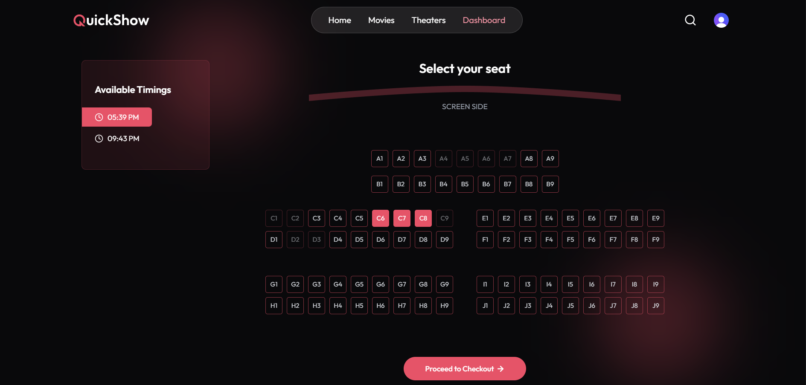
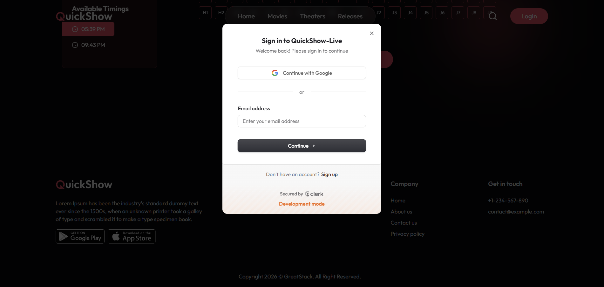
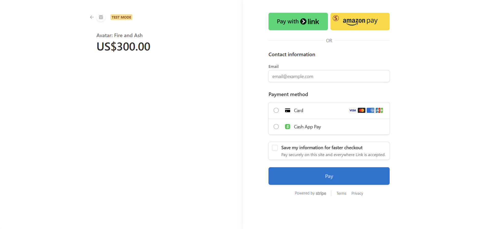

# QuickShow 🎬

A full-stack movie ticket booking platform with authentication, admin dashboard, and Stripe payments.

## 🚀 Tech Stack
- React.js (Vite)
- Node.js
- Express.js
- MongoDB
- Stripe

## ✨ Features
- User authentication (JWT)
- Movie listings
- Seat booking system
- Admin dashboard
- Payment integration (Stripe)

## 🛠 Installation

### Backend
cd server
npm install
npm run dev

### Frontend
cd client
npm install
npm run dev

## 📸 Screenshots

### 🏠 Homepage

### 🎬 Movie Details

### 🎟 Booking

### 🎟 Login Page

### 🎟 Payment Page

